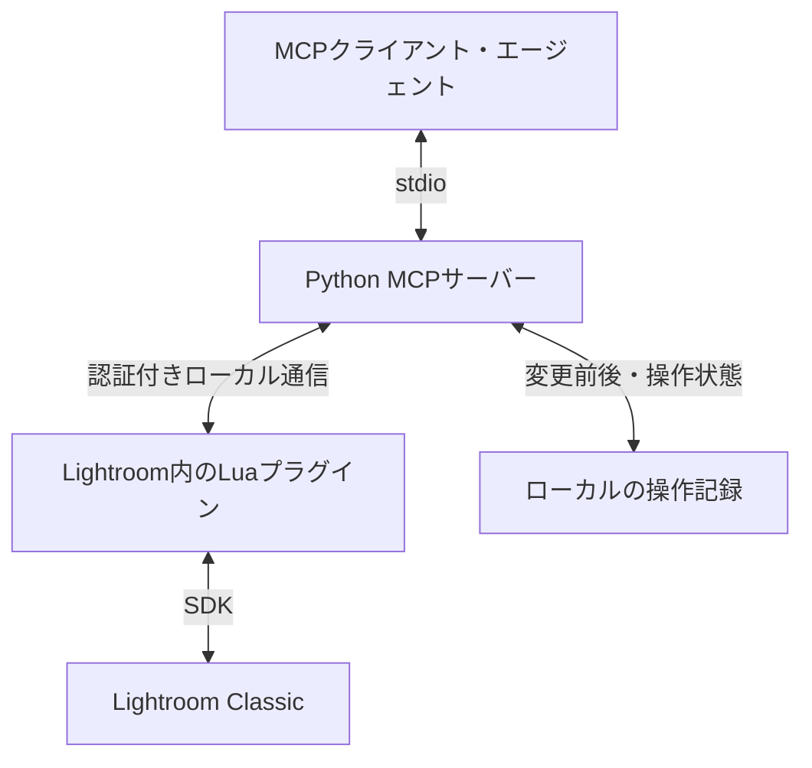

# Lrc-mcp

**Lightroom Classicの写真を、チャットで確認・現像・比較・復旧するためのMCP。**

写真を選んで「少し明るく、暖かさは残して、彩度は控えめ」と伝える。エージェントが写真を確認し、現像値を調整して、結果を返す。利用者は仕上がりと方向性を判断し、数値操作や一括処理を任せる。

> 現在は設計・実装計画の段階です。MCPサーバー、Lightroomプラグイン、インストーラーは未実装で、実機動作も未検証です。このREADMEの操作例は完成後に目指す体験です。

## ドキュメント

| 文書 | 内容 |
| --- | --- |
| [設計仕様書](docs/design/20260905-lrc-mcp-design-specification.md) | 要求、ユーザー体験、接続、API、データ、保存・復旧、エラー、SDK検証。仕様の正本 |
| [実装計画書](docs/planning/20260905-lrc-mcp-implementation-plan.md) | タスク、依存関係、配置、完了条件、試験、実機受入。実装順と進捗の正本 |

仕様を変更する場合は設計仕様書を先に更新し、影響する実装計画とREADMEを同期します。

## 目指す操作体験

初回の導入・接続設定を済ませれば、Lightroomとチャットを並べて使えます。

| 指示例 | 動作 |
| --- | --- |
| 「この写真を見て」 | 選択写真の現在の現像結果を取得 |
| 「少し明るく、暖色寄りに」 | 変更前を保存し、調整・検証・プレビュー表示 |
| 「黄色すぎる。もう少し自然に」 | 現在値を確認して微調整 |
| 「最初と比較して」 | 編集前後を同じ表示条件で比較 |
| 「一つ前に戻して」 | 直前のMCP操作を、競合を確認して復旧 |
| 「同じ設定を残りにも」 | 指定項目の現像値をコピー |
| 「この雰囲気にそろえて」 | 各写真を見ながら写真別の値を提案・適用 |
| 「止めて」 | 未着手の処理を止め、適用済みと残りを報告 |

指示済みの範囲では、毎回の承認を挟まず「実行→結果確認」で進める設計です。対象が曖昧なときや手動編集と競合したときだけ確認します。利用するMCPクライアント側の許可設定は別途適用されます。

画像を見たうえでの提案には、画像入力に対応するモデルが必要です。表示方法はクライアントに依存します。「同じ雰囲気」は画像に基づく判断であり、数値のコピーと区別します。任意のルックの再現や完全一致を保証するものではありません。

## どう接続するか

Lightroom内にLuaプラグインを入れ、同じMac上のMCPサーバーから操作します。実際の現像処理はLightroom SDKを通してLightroom自身が行います。[Adobeの開発者向け案内](https://developer.adobe.com/lightroom-classic/)

画面の座標に依存する自動クリックは使いません。SDKが必要とするモジュール・選択状態への対応はプラグインが担当します。

## 最初に完成させるもの

| 段階 | 範囲 | 現在の状態 |
| --- | --- | --- |
| M0 | SDK接続、4項目の変更、画像取得、保存・復旧の実証 | 未着手 |
| M1 | 1枚の露光量・彩度・コントラスト・色温度、比較、履歴、復旧 | 未着手 |
| M2 | 一括編集、写真別調整、途中停止、再接続、導入・診断 | 未着手 |
| M3 | 検索、評価、タグ、コレクション、プリセット、インポート、書き出し、仮想コピー | 後続拡張 |

初期対象はmacOSのLightroom Classicです。対応するアプリ・SDKの版とRAW/JPEGごとの操作範囲は実機検証で確定します。Windows、リモート公開、複雑なマスク、AIノイズ除去は後続の検討事項です。

## 変更と復旧の方針

- 写真をIDで固定し、途中で選択を変えても別写真へ編集しません。
- 変更前の記録とスナップショットを保存してから適用します。
- 許可した値だけを変更し、Lightroomから読み戻して結果を確認します。
- 同じ要求を再送しても相対調整を二重加算しません。状態が不明なときは先に照合します。
- 後から手動編集が入っていたら、復旧による上書きを停止します。
- バッチの部分成功と画像取得の失敗を区別して報告します。

原本削除、カタログDBへの直接書き込み、任意コード実行は公開しません。スナップショットは現像状態の保存であり、原本やカタログ全体のバックアップではありません。Lightroom自身のXMP自動書き込み等がファイルへ与える影響は、形式と設定ごとに検証します。

MCPサーバーとLightroomの通信はローカルです。ただし、チャットへ返したプレビューは利用するAIホストからクラウドへ送られる場合があります。完全ローカルの処理にはローカル推論を含む構成が必要です。

## 導入について

現在、実行可能な導入コマンドや配布物はありません。完成後は次の順序を予定しています。

1. 同じリリースのMCPサーバーとLightroomプラグインをMacへ配置する。
2. Lightroomのプラグインマネージャーで有効にする。
3. ローカルコマンドを起動できるMCPクライアントへサーバーを登録する。
4. 診断で接続・対応機能・カタログを確認する。
5. テスト写真で変更と復旧を確認して使い始める。

Lightroomは起動して、対象カタログを開いて使用します。通常起動時にプラグインの再インストールや自動更新を行わない設計です。

## 実装を始める人へ

[実装計画書のT-00](docs/planning/20260905-lrc-mcp-implementation-plan.md#t-00基盤)から進めてください。SDK固有の不明点はT-01の小さな実機プローブで確定し、型・記録・MCP接続のテストと組み合わせて実装します。

MacやLightroomにアクセスできない場合は、型検証、永続化、模擬ブリッジ、MCP接続の実装まで進められます。実機で確認していない機能を完成扱いにしないでください。タスクの状態・完了条件・要求IDは実装計画書に集約しています。

## 参考にする実装

| プロジェクト | 参考にする要素 |
| --- | --- |
| [varunkumar/lightroom-mcp](https://github.com/varunkumar/lightroom-mcp) | 現像調整とプレビューを使う対話体験 |
| [Automaat/lightroom-mcp](https://github.com/Automaat/lightroom-mcp) | ローカル接続、認証、写真検索・管理 |
| [4xiomdev/lightroom-classic-mcp](https://github.com/4xiomdev/lightroom-classic-mcp) | SDK経由の変更、スナップショット、検証 |

参考元の全面監査・実機比較は未実施です。既存コードを転用する場合は対象コミットとライセンス条件を確認し、必要な告知を残します。現段階では設計文書のみで、参考実装のコードは取り込んでいません。

Adobeの公式・認定MCPではありません。

## 設計の成立背景

[仕様書 v0.1](docs/design/20260905-lrc-mcp-design-specification.md)は、2026-09-05 にチャット上の設計案を具体化した実装前の文書です。自前化の理由は、公開する操作、依存関係、変更記録、復旧条件を管理できるようにすることです。参考MCPに特定の脆弱性を確認したための置き換えではなく、現段階で既存コードを取り込んだforkでもありません。この文書の日付と、将来の実装・実機検証・リリースは区別して扱います。

