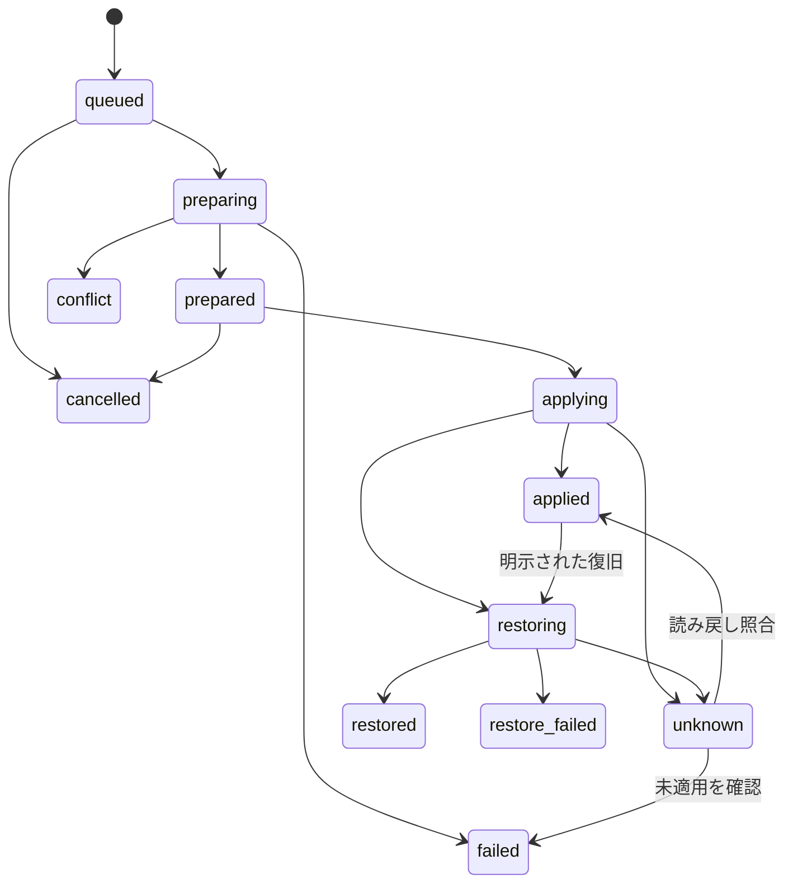

# Lrc-mcp 設計仕様書

作成・更新日：2026-09-05  
文書ID：LRC-SPEC-001／仕様版：0.1  
状態：実装前の仕様。実機で確認していないAPI・互換性は本書の検証項目として管理する。  
対象リポジトリ：[masa-san-jp/Lrc-mcp](https://github.com/masa-san-jp/Lrc-mcp)

## 1. 目的と文書の位置づけ

Lightroom Classicで写真を開き、自然言語で方向性を伝え、エージェントに写真の確認・現像値の変更・比較・復旧を任せる。利用者は仕上がりを判断し、数値操作と反復作業をエージェントへ委ねる。

本書を要求・インターフェース・処理契約のSSOTとする。[実装計画書](../planning/20260905-lrc-mcp-implementation-plan.md)は実装順・作業単位・完了条件のSSOT、[README](../../README.md)は概要と入口である。同一ルールを別文書で独自に再定義しない。仕様変更は本書を更新し、影響するタスク・試験・READMEを同じ変更で同期する。

これまでのチャットの設計案を具体化した文書であり、機能が完成したという報告ではない。特定の既存MCPの脆弱性を確認したわけではない。自前化の目的は公開する操作、依存関係、変更記録、復旧条件を管理できることにある。

### 1.1 情報の区分

| 区分 | 意味 |
| --- | --- |
| 確認済み事実 | 公式資料、または参考実装の文書・該当コードで確認した事項。出典は第16章 |
| 本プロジェクトの仕様 | このMCPが実装すべき動作。既存ソフトの保証ではない |
| 実機検証事項 | SDKやLightroomの動作確認で確定させる事項。未確認のまま対応済みにしない |

## 2. 対象とリリース範囲

### 2.1 環境

| 項目 | 初期対象 |
| --- | --- |
| アプリ | ローカルのAdobe Lightroom Classic。クラウド版Lightroomとは区別する |
| OS | macOS。最初の実機検証対象はApple Silicon。Windowsは後続の互換性追加 |
| サーバー | Python 3.11以上を設計基準とし、依存解決と検証で対応範囲を固定 |
| プラグイン | Lightroom内のLua。使用言語仕様は採用SDKに合わせる |
| クライアント | ローカルコマンドを起動できるMCPクライアント。画像確認には画像入力対応モデルが必要 |
| アプリ状態 | Lightroomを起動し、対象カタログを開き、プラグインを有効にして使用 |
| 同時利用 | 1 OSユーザー・1 Lightroomインスタンス・1カタログ・1 MCPサーバープロセス |

特定のLightroom最低バージョンを推測で宣言しない。アプリ、SDK、プラグイン、プロセスバージョン、ファイル形式を組にして検証結果を記録する。未検証の組では、読み取りが可能でも書き込みは有効にしない。互換性追加はソース管理された対応表と試験証跡の更新で行う。

### 2.2 機能の段階

| 段階 | 完成させる体験 | 対象機能 |
| --- | --- | --- |
| M0：接続実証 | テスト写真1枚を取得・変更・確認・復旧 | SDKプローブ。通常利用向け公開前 |
| M1：単写真MVP | チャットで1枚を調整し、比較して戻す | 露光量、彩度、コントラスト、色温度、プレビュー、変更記録、復旧 |
| M2：日常利用版 | 選択写真の一括編集を中断・再確認しながら完了 | バッチ、部分成功、再接続照合、進捗、キャンセル、雰囲気統一のエージェント手順、導入・診断 |
| M3：管理・出力拡張 | 検索から整理、現像、書き出しまで進める | 検索、評価、キーワード、コレクション、プリセット、インポート、最終書き出し、仮想コピー |

M3は拡張要件であり、M2の完成条件に混ぜない。M3の書き込みAPIはそれぞれの復旧契約とSDK確認後に追加する。

初期範囲外：写真・原本の削除、原本への独自の上書き、カタログDB直接編集、任意Lua/Python/シェル実行、UIの座標クリック、複雑なマスク・AIノイズ除去・動画編集、ネットワーク越しのMCP公開、常時監視、新規チャットUI、内蔵LLM。

## 3. ユーザー体験

### 3.1 初回導入の完成形

1. 自前リリースのMCPサーバーとプラグインをMacへ導入する。
2. Lightroomのプラグインマネージャーで有効にする。
3. 使用するMCPクライアントへ、サーバーの絶対パスと起動引数を登録する。
4. 診断でバージョン、接続、カタログ、画像対応を確認する。
5. テスト用写真で「見る→変更→比較→戻す」を確認し、通常利用へ移る。

現時点でインストーラーや実行コマンドは未実装。完成前のREADMEに動作済みの導入手順を掲示しない。

### 3.2 日常の操作

| 利用者の指示 | エージェントの行動 | 見える結果 |
| --- | --- | --- |
| 「この写真を見て」 | 選択を固定し、現像済みプレビューを取得 | 対象名、写真、現在の状態 |
| 「少し明るく。暖かさを残して彩度は控えめ」 | 現像値を読み、調整を計画し、保存・適用・検証 | Lightroomに反映、チャットに画像と短い変更説明 |
| 「黄色すぎる。もう少し自然に」 | 前回結果を読み直し、色温度を調整 | 更新されたプレビュー |
| 「最初と比較して」 | 編集開始時のプレビューと現在のプレビューを取得 | 同じ写真・同じ表示条件の前後比較 |
| 「一つ前に戻して」 | 対象操作IDを解決して復旧 | 戻った値と画像。競合時は理由を提示 |
| 「同じ設定を残りにも」 | 参考写真の指定4項目を絶対値でコピー | 写真ごとの適用結果 |
| 「この雰囲気にそろえて」 | 参考画像と各写真を見て、写真別の変更計画を作る | 調整結果と未達・保留の写真 |
| 「止めて」 | 未着手分を停止し、実行中の1枚の状態を確定または不明として記録 | 完了枚数、残り、照合が必要な写真 |

指示済みの範囲では計画と適用を続けて実行する。`plan`は人への承認要求を意味しない。対象・意図が特定できないとき、復旧と手動編集が競合するときだけ追加の判断を求める。MCPクライアント自身の許可設定は別であり、このサーバーから無効化しない。

### 3.3 モデルとMCPの責務

モデルが判断するもの：写真の解釈、希望の言語化、調整値の提案、見た目の比較。MCPが決定的に処理するもの：対象解決、入力検証、保存、変更、結果の読み戻し、競合判定、操作の重複防止。

「雰囲気の一致」は美的判断を伴い、4項目だけで任意のルックを再現できるとは保証しない。画像を扱えないクライアントでは数値操作のみ利用可能と表示する。画像を見たという報告はしない。画像表示方法もホストに依存するため、インライン表示と保存済みプレビューの参照を区別する。

改善ループは第12章の上限で終了させる。達成できなければ、適用済み値・現在画像・不足理由を返して終了する。

この反復上限は本プロジェクトのエージェント手順で管理する。MCPサーバー単体では、任意のホストの推論や別々のユーザー指示を識別して停止できない。サーバーが強制する範囲は各要求・ジョブの期限と件数、ホスト側が管理する範囲は自然言語の目標ごとの反復である。

## 4. 要求一覧

| ID | 必須動作 | 完成段階 |
| --- | --- | --- |
| FR-01 | 接続・対応機能・バージョンを取得する | M1 |
| FR-02 | カタログと対象写真を明示IDで固定する | M1 |
| FR-03 | 現像値、形式、状態を読み取る | M1 |
| FR-04 | 現在の現像を反映した縮小プレビューを返す | M1 |
| FR-05 | 4項目を絶対値または差分で計画する | M1 |
| FR-06 | 保存成功後のみ変更し、読み戻して検証する | M1 |
| FR-07 | 操作IDによる履歴照会、競合を検出した復旧を提供する | M1 |
| FR-08 | 同じ要求の再送、応答喪失、再起動で無条件の再適用をしない | M1 |
| FR-09 | 編集前後を同条件で比較できる | M1 |
| FR-10 | バッチの写真別結果、途中停止、部分成功を返す | M2 |
| FR-11 | 同設定コピーと写真別の雰囲気統一を区別する | M2 |
| FR-12 | 導入、接続診断、停止・再接続を説明可能にする | M2 |
| FR-13 | 写真の検索・整理・プリセットを段階追加できる | M3 |
| FR-14 | 許可した場所へのインポート・書き出し・仮想コピーを追加できる | M3 |

| ID | 共通の制約 |
| --- | --- |
| INV-01 | Lightroomへの変更はSDKを通す。カタログDBへ直接書かない |
| INV-02 | 写真の同一性と変更前状態が一致しなければ書かない |
| INV-03 | 許可項目・単位・範囲をサーバーとプラグインの両側で検証する |
| INV-04 | 変更前記録とスナップショットの保存失敗時は現像変更しない |
| INV-05 | 不明・失敗・部分成功を成功として報告しない |
| INV-06 | 同じ操作IDを異なる内容で利用させず、再送で相対値を二重加算しない |
| INV-07 | 復旧で後続の他者・手動編集を黙って上書きしない |
| INV-08 | ローカル接続の認証を必須とし、任意コード実行を公開しない |
| INV-09 | 書き出しのルートと画像共有範囲を制御し、秘密情報をログへ残さない |
| INV-10 | モック成功とLightroom実機成功を明確に区別する |
| INV-11 | 一つのカタログへの書き込みは直列化する |
| INV-12 | 各要求・ジョブ・改善ループは期限または回数上限で必ず応答する |

## 5. アーキテクチャ

AdobeはLightroom内のLuaプラグインとSDKを提供している[S1]。外部プロセスとのソケット接続、現像値の変更、スナップショット操作の例は参考実装でも確認できる[S3][S5]。本プロジェクトは次の境界を持つ。

| 部品 | 実装候補・責務 |
| --- | --- |
| MCPホスト／エージェント | 自然言語と画像を扱う。モデルの費用・送信先・UIはホストが管理 |
| Pythonサーバー | 公式MCP Python SDK、型検証、計画、SQLite記録、ジョブ、画像返却 |
| ローカルブリッジ | Lightroomの`LrSocket`とTCP。要求・応答の2経路、認証、相関ID、期限 |
| Luaプラグイン | 接続制御、入力の再検証、SDKアダプター、変更前保存、読み戻し |
| Lightroom Classic | カタログと現像処理、プレビューのレンダリングを実行 |

PythonはstdioのMCPメッセージだけをstdoutへ出す。ログはstderrまたは専用ファイル。MCPの通信仕様は公式SDKへ任せ、独自ブリッジのJSONと混同しない[S6][S7]。SDKは採用時点の安定版を正確なバージョン・ハッシュで固定する。異なるメジャー版のAPI例を混在させない。

UI操作は採用しない。基本は写真オブジェクトをIDから解決して操作する。`LrDevelopController`が必要になる項目は選択・現像モジュールへの依存をアダプターに閉じ込め、操作前後の対象再照合と選択復元を実機確認する。ID指定で安全に実装できない操作は非対応とする。

## 6. 接続・認証・ライフサイクル

### 6.1 起動と停止

1. 明示的な導入処理がユーザー専用のデータ領域、認証トークン、設定を作る。通常起動は更新・再インストールをしない。
2. 有効化されたプラグインが設定を読み、要求受信用と応答送信用のソケットを開始する。`LrSocket.bind`の2モードを使う方式を初期候補とする[S3]。
3. `bridge.json`にブリッジ世代ID、ポート、プロトコル版を一時ファイルから置換して公開する。秘密トークンは含めない。
4. MCPホストがPythonサーバーを子プロセスとして起動。サーバーは単一起動ロックを取り、両経路の疎通と共有トークンを検証する。
5. アプリ・プラグイン・カタログの状態を読み取る。両経路のペアが確認されるまでは現像要求を送らない。
6. Lightroomが閉じているときもMCPのツール一覧は返せる。操作は`LIGHTROOM_UNAVAILABLE`として期限内に返す。アプリを勝手に起動・終了しない。
7. 正常終了は未着手分を停止し、実行中要求の状態を記録して切断する。Lightroomは起動したままにする。

初回有効化後の自動接続を目標とするが、プラグイン画面に開始・停止・状態表示を設ける。自動開始のSDK制約があれば互換性レポートと導入手順に明記する。

### 6.2 通信制約

- ソケットはループバック限定。OS上の実際の待受アドレスを検証する。SDKに存在しない`host`引数を想定して済ませない。外部インターフェースで待ち受ける場合はM0不合格とし方式を再設計する。
- ポートは設定で一対を指定し、使用中なら失敗を返す。他プロセスを停止しない。初期値は導入時に空きを検査して選び、接続側は`bridge.json`から解決する。
- 初回導入でPythonの暗号学的乱数から256ビットトークンを生成。ディレクトリは0700、ファイルは0600。同一OSユーザーの正規プロセスのみを想定する。Luaで権限を設定できると仮定しない。
- トークンはアプリケーションからエージェントへ返さない。プロセス引数・環境変数経由の露出を避け専用ファイルから読む。全要求を認証し、応答も世代ID・接続nonce・要求IDを照合する。
- 受信ソケットのコールバックは検証・キュー投入までとし、待機や現像処理を非同期の直列ワーカーへ渡す。コールバックから無制限にSDK処理を起動しない。
- 再起動・再接続で世代IDと接続nonceを更新し、以前の接続からの遅延応答を捨てる。二つのソケットが異なる接続相手に向いていないことをnonceの往復で確かめる。
- 認証失敗時に写真情報を返さない。ログは秘密値なしのエラーコードのみ。攻撃的な要求サイズ・頻度は第12章の制限で打ち切る。

同じユーザー権限を奪取したプロセスや管理者権限を持つ攻撃者まで、この認証だけで隔離できるとはしない。

### 6.3 内部ブリッジ契約

UTF-8、改行区切りの1 JSON／1フレーム。文字列内の改行はJSONエスケープする。サイズ上限、未知フィールド拒否、JSON型検証を両端に実装する。次はMCP通信とは別の内部要求例である。

```json
{
  "bridge_version": 1,
  "bridge_instance_id": "bridge-example",
  "connection_nonce": "nonce-example",
  "request_id": "req-example",
  "auth_token": "<実際のトークンは例・ログに記録しない>",
  "command": "apply_prepared_edit",
  "timeout_ms": 30000,
  "payload": {
    "operation_id": "op-example",
    "photo_id": "photo-example",
    "prepared_token": "prepared-example"
  }
}
```

要求IDは通信ごと、操作IDは意味のある編集ごとに別管理する。応答は同じ世代・nonce・要求ID、`ok`、`data`または`error`を返す。共有トークンの確認は最初の疎通で両方向を確認し、その後の要求にも付ける。生の受信フレームをログへ書かない。

内部コマンドは固定レジストリで定義し、公開MCPより低水準でも任意SDKメソッド名の実行機能を設けない。主なコマンドは`hello`、`inspect`、`prepare_edit`、`apply_prepared_edit`、`read_operation`、`render_preview`。復旧は同じ編集パイプラインに復旧種別を渡す。

## 7. データモデルと現像パラメーター

### 7.1 識別と状態

| 型 | 必須フィールド・規則 |
| --- | --- |
| CatalogRef | `catalog_id`、`catalog_session_id`。IDは登録したカタログ実体に対応する不透明な識別子。生パスを外部IDにしない |
| PhotoRef | CatalogRef＋`photo_id`。ファイル名・選択番号・原本パスは主キーにしない。仮想コピーを別写真として識別 |
| PhotoState | PhotoRef、`state_token`、形式、プロセスバージョン、正規化した現像値、項目別の対応・単位・範囲 |
| EditPlan | `plan_id`、有効期限、写真の固定リスト、期待状態、変更前値、絶対値に解決した変更後値、依存項目、ポリシー版 |
| Operation | `operation_id`、計画ID、種別、内容ハッシュ、写真別状態、変更前後値、スナップショットID、エラー、作成・更新時刻 |
| Preview | `preview_id`、PhotoRef、対応状態、生成時刻、寸法、色空間、ファイルハッシュ、管理ファイルID |

`catalog_session_id`は開くたびに変える。カタログのコピー・移動を既存カタログと自動同一視しない。OS上の実体識別とSDKの識別情報の組で判定し、曖昧なら新規登録として扱う。過去操作の復旧先を名前だけで決めない。具体的なSDK／OS取得方法はG-01で確定する。

`state_token`はプラグイン発行の期限付き不透明トークンとする。対応する写真と正規化済み現像状態をプラグインが保持し、適用直前のSDK読み取りと比較する。Python側のハッシュを唯一の競合判定にしない。再起動後はトークンを失効させ、必要な状態を再取得する。

競合判定用状態は、SDKが読み出せる現像設定のうちレンダリングに影響するものと形式・プロセス版を含める。選択位置や生成時刻などの一時情報は除外する。どのSDKキーを含むかはバージョン付きマッピングで固定し、読み出し不能な状態は`UNSUPPORTED_STATE`とする。スナップショット生成だけでは競合トークンの現像状態を変えない。

### 7.2 公開パラメーター

| 公開名 | 意味 | 単位 | SDKとの対応方針 |
| --- | --- | --- | --- |
| `exposure` | 露光量で明るさを調整 | `ev` | `Exposure2012`等のキー候補をプロセス版別にG-02で確定 |
| `saturation` | 全体の彩度 | `slider` | `Saturation`等の候補を検証 |
| `contrast` | コントラスト | `slider` | `Contrast2012`等の候補をプロセス版別に検証 |
| `temperature` | ホワイトバランスの色温度 | `kelvin`または`relative_slider` | RAW/JPEG等の形式別にキー・単位・変換を検証 |

各値は有限数。数値文字列・boolean・NaN・無限値を受理しない。`mode`は`absolute`または`delta`、`unit`を必須とする。範囲は検証済みの対応表から取得して`inspect_photos`で返す。範囲外を黙って丸めない。異なる単位を一括で送ったときは該当写真を計画から除外せず、計画失敗として説明する。

相対値は計画時に読み取った値から絶対値へ変換し保存する。再試行時に相対計算をやり直さない。

色温度変更に`WhiteBalance=Custom`やTintの保持が必要な場合、それらを依存項目として変更計画・保存・読み戻し・復旧に含める。現像モードによる暗黙の副作用を自由に許容しない。依存関係、step、許容誤差、対象キーはG-02の実測とSDK資料で確定する。プロセス版を編集の都合で勝手に変換しない。

## 8. 公開MCPツール契約

### 8.1 共通規則

引数はJSONオブジェクト、未知フィールドは禁止。公開スキーマと検証コードは同じ型定義から生成し、PythonとLuaの相違は共通fixtureで検出する。MCPの出力形式は使用する公式SDKに従い、成功値とエラーを構造化する[S7]。

ドメインエラーは`code`、日本語`message`、`retryable`、必要なら`operation_id`・写真別詳細を含む。`retryable`は通信を無条件再送してよいという意味ではない。副作用が始まった要求は操作状態を先に照会する。

読み取りツールはread-onlyとして注記する。`plan_adjustments`はカタログを変えないが一時計画を作る。`apply_plan`と`restore_operation`は書き込みとして注記する。ツール注記は実際の入力検証や認証を代替しない。

### 8.2 ツール一覧

`PhotoRef`、`PhotoState`、`EditPlan`等は第7章の型を指す。IDはサーバー発行値を使い、モデルが架空の値を作らない。

| ツール | 必須入力／任意入力 | 主な出力・契約 |
| --- | --- | --- |
| `get_capabilities` | `{}` | 接続状態、アプリ/SDK/プラグイン版、対応機能、非対応理由、制限値。Lightroom停止中も診断可能 |
| `get_selection` | `{}` | CatalogRef、対象PhotoRef配列、主選択ID、件数。空選択時は空配列を返し、全件へ拡大しない |
| `inspect_photos` | `photos: PhotoRef[]` | 順序付きPhotoState配列。欠損・未対応は写真別エラー |
| `render_preview` | `photo: PhotoRef`／`expected_state_token`、`long_edge` | PreviewとJPEGコンテンツ。取得前後に状態が変われば画像を成功結果として返さない |
| `plan_adjustments` | `items: [{photo, expected_state_token, adjustments}]` | EditPlan、変更差分、有効期限。いずれかが不正なら計画全体を作成しない |
| `apply_plan` | `plan_id`、`operation_id` | 永続的に受理したOperationを返す。実行はジョブとして進み`get_operation`で確認 |
| `get_operation` | `operation_id`／結果の`cursor` | ジョブ状態、写真別状態、件数、エラー、前後プレビュー参照、必要な照合手順 |
| `restore_operation` | 復旧対象の`operation_id`、新規`restore_operation_id`／対象PhotoRefの部分集合 | 復旧ジョブ。元操作が変更した項目＋依存項目のみを戻す。対象集合の拡大は禁止 |
| `compare_previews` | `before_preview_id`、`after_preview_id` | 同一PhotoRef・同じ表示条件の前後画像。失効した画像を別状態の画像で代用しない |
| `cancel_operation` | `operation_id` | キャンセル受付と現在状態。未着手分を止める。実行中SDK呼び出しの即時取消を保証しない |

`get_selection`の結果が上限を超える場合は件数と`SELECTION_TOO_LARGE`を返す。黙って先頭だけを編集しない。`get_operation`のページサイズは最大100件、カーソルは操作IDと結果リビジョンに結びつけ、状態更新で失効したら先頭から取得する。

M1では計画の対象を1枚に制限し、全MCPツールの契約はM2と共通にする。公開ツール名は固定し、利用可否は実行時capabilitiesで返す。必要のないM3ツールは未実装のまま成功を返すスタブとして公開しない。

`restore_operation`の対象は、元操作の写真集合のうち適用済みと確認できた写真に限る。部分集合を省略した場合もこの集合だけを対象にし、未適用・不明の写真には触れない。対象ゼロは変更なしとして返す。`apply_plan`で全写真が`no_change`なら、操作記録のみを完了させてSDK書き込みとスナップショットを省略する。

### 8.3 計画要求例

以下のIDは説明用。実際には直前の読取結果から取得する。

```json
{
  "items": [
    {
      "photo": {
        "catalog_id": "catalog-example",
        "catalog_session_id": "session-example",
        "photo_id": "photo-example"
      },
      "expected_state_token": "state-example",
      "adjustments": {
        "exposure": {"mode": "delta", "value": 0.3, "unit": "ev"},
        "saturation": {"mode": "absolute", "value": -10, "unit": "slider"}
      }
    }
  ]
}
```

SDKの生の設定辞書をこのAPIへ渡すことは認めない。重複PhotoRef、空の変更、期限切れ状態は明示エラーとする。既に同じ値の場合は`no_change`として返し、不要な履歴を作らない。

## 9. 保存・適用・整合性

### 9.1 写真単位の処理順

1. SQLiteへ計画の消費、操作ID、内容ハッシュ、対象一覧を一つのトランザクションで保存する。保存失敗なら未受付として返す。
2. 直列ワーカーが対象写真と最新状態を再解決する。カタログ、トークン、対応表、値の検証に失敗したら書かない。
3. 編集前プレビューを確保する。プレビュー取得後も状態を再確認する。
4. プラグイン内の`prepare_edit`が現像値を再読取し、期待状態との一致を検証する。変更前設定を捕捉し、名前に操作IDを含むLightroomスナップショットを作成する。
5. プラグインは写真・絶対変更値・変更前状態・スナップショットIDに固定した`prepared_token`を発行する。PythonはそれらをSQLiteへ永続記録する。
6. Pythonは`dispatching`状態を先に永続化し、その後に`apply_prepared_edit`を送る。プラグインはトークンの未消費、同一操作ID、期限、現在状態を再検証してから変更する。
7. SDKの書き込みスコープ内で許可項目のみ変更する。変更後を読み戻し、宣言した依存項目以外の差分がないかも検証する。
8. 読み戻しが一致すれば`applied`を記録する。続いて変更後プレビューを作る。画像生成に失敗した場合は現像の成否と分けて`preview_status=failed`とする。
9. 結果と履歴を永続化して返す。エージェントは数値一致とプレビューに基づき報告する。

計画・状態トークンの有効期限はジョブ受付時に検証する。受付済みの期待状態は当該操作専用としてジョブ期限までプラグインに保持し、バッチ後半で元の5分を超えただけでは失効させない。現在値との比較は各写真の実行直前に必ず行う。新規計画の期限をこの方法で延長することはできない。プラグイン世代が変わった場合は保持を破棄し、不明分を照合、未着手分を停止して新しい計画を要求する。

変更前スナップショットの作成後に通信・記録が失敗すると、現像変更なしでスナップショットだけが残る場合がある。操作IDを名前に残して診断可能にし、正常な編集として数えない。原本や無関係なスナップショットを自動削除して帳尻を合わせない。

スナップショットは現像状態の保存であり、原本・カタログ全体のバックアップではない。保存したことだけで原本削除等から復旧できるとは扱わない。

### 9.2 状態遷移



図は写真単位。`no_change`は計画時に判定し書き込み経路へ入れない。復旧の実行記録は元操作を消さず、別操作として関連づける。元操作の適用結果は履歴として不変で、現在の復旧状況を別フィールドで保持する。

ジョブ状態は`queued / running / succeeded / partial / failed / cancelled / needs_reconciliation`。`unknown`が1枚でもあれば`needs_reconciliation`、未着手なし・全件適用またはno_changeなら`succeeded`、成功と失敗の混在は`partial`。停止時に既適用があれば`partial`と`cancel_requested=true`、既適用ゼロで全件未変更なら`cancelled`。適用できた写真のプレビュー欠損はジョブの現像成功を変更せず別の警告とする。

### 9.3 重複要求とクラッシュ

- `operation_id`は全操作で一意。同じID・同じハッシュは既存結果、同じID・異なるハッシュは`IDEMPOTENCY_CONFLICT`。
- 1計画は1操作にだけ結びつける。別操作IDで同じ計画を再適用できない。
- プラグインも実行中世代の操作ID＋写真IDを記憶し、同じ`prepared_token`を再消費しない。
- Python停止後は新規書き込み前に`dispatching/applying/unknown`を照合する。Lightroom再起動でプラグインの記憶が消えても、SQLiteの記録と写真の現在値から状態を判定する。
- Pythonまたはプラグインの再起動で実行主体が変わった場合、以前の未着手ジョブを自動で続行しない。実行中分の状態を確定し、未着手分を停止結果として返す。続きは新しい状態から再計画する。
- 現在値が保存した変更前状態なら`not_applied`として終了し、再編集には新計画が必要。変更後状態と一致すれば`applied`と`verification=reconciled`を返す。それ以外・同一性不明は`unknown`を維持する。
- 状態の一致は、その間に手動編集が一度もなかった証明ではない。復旧時も第10章の競合検証を行う。
- 応答期限切れは「適用失敗」と同義ではない。SDKがまだ実行中なら、そのカタログへの新規書き込みをブロックし、状態照合だけを許可する。
- SDKに強制中断がなければアプリを殺して中断しない。クライアントへは期限内に不明状態を返し、ワーカーの遅延完了を照合する。

SQLiteはトランザクションと永続書き込み設定を利用する。Luaのファイル保存やSDKスナップショットが電源断まで含めて完全に耐久的だと仮定しない。通常のプロセスクラッシュを主要な検証対象とし、ハードウェア故障・記録自体の破損は復旧保証の範囲外と記載する。

### 9.4 UIとの競合

自前MCP間はロックで直列化するが、LightroomのUIや他プラグインの全操作を排他できるとは限らない。書き込み前後の読み取りで差分を検出し、確認できない場合は`unknown`または`conflict`を返す。排他範囲と時間窓をG-03で記録する。

## 10. 復旧と履歴

通常の復旧対象はその操作が変更した4項目の部分集合と依存項目。現在の現像状態が元操作の検証済み適用後状態と一致することを確認する。後続の手動編集を検出した場合、関係する項目だけの変更であっても初期版は保守的に`RESTORE_CONFLICT`で停止する。強制上書きパラメーターは設けない。

同じMCPが行った直近操作の復旧は、保存した項目を戻す新しい操作として第9章を通す。復旧前も保存するため、復旧操作自体を戻せる。スナップショット全体への復元は初期公開APIに含めない。Lightroomの全体Undoを自動で実行して、別の手作業まで戻すことはしない。

書き込み後の検証失敗時は、後続変更がないと確認できる範囲で補償処理を行う。変更が競合しているときは自動復旧しない。復旧も失敗すれば`restore_failed`、状態が読めなければ`unknown`とし、写真ID・変更前値・適用予定値・現在値・スナップショットIDを回復情報として返す。

履歴はSQLiteに保持し、操作、写真別処理、復旧関連、プレビュー参照を分離する。`operations`、`operation_items`、`plans`、`previews`、`catalog_registry`を最小テーブルとし、変更前後の設定はスキーマ版付きJSONとして保存する。SQLにはパラメーターを使う。

操作記録は自動削除しない。プレビューは容量制限により管理できるが、未完了・不明操作の回復に必要な記録は消さない。プレビューを削除したら`PREVIEW_EXPIRED`を返す。削除済みの編集前画像を、現在画像から推測生成して代用しない。

## 11. プレビュー・比較・情報の扱い

現像前の原本サムネイルと、現在の現像を反映した画像を区別する。初期版はLightroomの書き出し機能で現像済みのJPEGを生成する経路を採用候補とする。使用API、待機方法、色管理はG-04で検証する。

- SDR・sRGB・長辺1600pxを初期標準とする。出力品質80相当を候補とし、SDKの値域へ変換して検証する。前後比較は寸法、色空間、品質を一致させる。
- HDR素材はSDRプレビューとして扱ったことを明記する。HDR出力やモニター表示の完全一致を保証しない。
- SDKに画像出力を指示する前後で写真と現像状態を照合する。状態変化時は`PREVIEW_STALE`を返す。
- ローカルの専用キャッシュへランダムIDで保存し、エージェントから任意保存パスを受け取らない。出力検証は実パス、通常ファイル、サイズ、画像形式を検査し、シンボリックリンクでキャッシュ外へ出ないようにする。
- JPEGからGPS・IPTC・不要なEXIFを除去し、色管理に必要な情報を保持する。除去結果を試験する。ファイル名等の文字列はデータとして扱い、命令として解釈しない。
- チャットへ返した画像やメタデータは、利用するAIホストがクラウドへ送信する場合がある。MCPのローカル通信と完全ローカル推論は区別する。
- 元画像は任意読取ツールで返さず、初期版は縮小プレビューを返す。画素内の人物や文字まで自動匿名化する仕様ではない。

## 12. 制限値とバッチ運用

以下は初期の工学的な設定値であり、最適値や実測性能ではない。変更理由と試験結果を伴って調整可能とする。上限を変えても保存・競合・重複防止の契約は変更しない。

| 設定 | 初期値 | 到達時の動作 |
| --- | --- | --- |
| 1計画の写真数 | M1は1、M2は100 | 拒否して分割を案内。黙って切り捨てない |
| 同時SDK書き込み | 1 | 直列キューで待機 |
| 接続・疎通期限 | 5秒 | 接続エラーを返す |
| 読取要求期限 | 10秒 | 読取失敗。副作用がない要求のみ最大2回再試行 |
| 1枚の変更要求期限 | 30秒 | 実行済みか不明なら照合へ。無条件再送しない |
| プレビュー期限 | 60秒 | プレビュー失敗を返す。適用済み変更を繰り返さない |
| ジョブ実行期限 | 15分 | 未着手分を停止。実行中写真を照合 |
| 計画・状態トークン有効期限 | 5分 | 新しい読み取りと計画を要求 |
| 内部制御フレーム | 1MiB | 処理前に拒否。画像バイトをこの経路へ埋め込まない |
| 1プレビュー | 5MiB、長辺最大2048px | 範囲エラーまたは出力失敗 |
| プレビューキャッシュ | 2GiB | 完了分から期限切れ化。未完了に必要な画像を消せない場合は新規処理を止める |
| エージェントの自動改善 | 同じ指示・同じ写真に最大3回の適用 | 現状と未達理由を返して終了。利用者の新しい指示で再開可能 |
| 自動再接続 | 1接続要求につき最大3回・合計10秒以内 | エラーを返し、無限待機しない |

`apply_plan`は受理・永続記録後にジョブIDを返すため、バッチ全体をMCPの単一応答期限で待たせない。ポーリングは段階的間隔、最大5秒とし、操作の終了状態に達したら止める。クライアントが進捗通知を扱える場合は併用する。

バッチは全体の原子性を保証しない。写真単位の復旧可能な処理として設計する。個別写真の入力競合はその写真をスキップして継続できるが、記録失敗・接続喪失・SDK状態不明・カタログ切替は未着手全体を停止する。画像がオフラインなら理由を返し、別画像や埋込サムネイルへ無言で置き換えない。

雰囲気統一はエージェントが参考PhotoRefとプレビューIDを固定して行う。各写真を検査→写真別計画→適用→比較の順で処理し、改善上限を記録する。範囲の拡大は利用者の指示に基づき行う。すべて同じ値にする処理を雰囲気統一として報告しない。

## 13. エラーと診断

| コード | 意味と次の処理 |
| --- | --- |
| `LIGHTROOM_UNAVAILABLE` / `BRIDGE_UNAVAILABLE` | アプリまたはプラグインが未接続。起動・有効化を案内 |
| `AUTH_FAILED` / `BRIDGE_VERSION_MISMATCH` | 認証またはプロトコル不一致。設定を再確認。編集しない |
| `SERVER_ALREADY_RUNNING` | 単一起動ロックが使用中。他のプロセスを停止しない |
| `CATALOG_CHANGED` / `PHOTO_NOT_FOUND` | 対象の同一性を確認できない。再取得 |
| `SELECTION_TOO_LARGE` / `LIMIT_EXCEEDED` | 上限超過。対象分割または設定見直し |
| `INVALID_ARGUMENT` / `UNSUPPORTED_PARAMETER` / `UNSUPPORTED_STATE` | 型、パラメーター、現像状態が未対応 |
| `UNIT_MISMATCH` / `OUT_OF_RANGE` | 単位・値域が不正。変更計画を作り直す |
| `STALE_STATE` / `PLAN_EXPIRED` | 期待状態または有効期限が不一致。再読取 |
| `PERSISTENCE_FAILED` / `SNAPSHOT_FAILED` | 変更前保存に失敗。現像変更しない |
| `IDEMPOTENCY_CONFLICT` / `PLAN_ALREADY_CONSUMED` | 操作IDの再利用不正、または計画の再適用 |
| `VERIFY_FAILED` / `OPERATION_UNKNOWN` | 読み戻し不一致、または適用状態不明。新規書き込みを止め照合 |
| `RESTORE_CONFLICT` / `RESTORE_FAILED` | 復旧先が変化、または復旧失敗。回復情報を提示 |
| `PREVIEW_FAILED` / `PREVIEW_STALE` / `PREVIEW_EXPIRED` | 画像生成失敗、生成中の状態変化、キャッシュ期限切れ |

診断は、アプリの有無、プラグイン有効状態、両ソケット、認証、プロトコル版、カタログ、対応表、データ領域の書き込み可否を区別する。ログ共有用出力ではユーザー名、生パス、GPS、トークンを伏せる。依存ライブラリの版とエラーコードは含める。

## 14. SDK検証ゲート

API名は参考実装からの候補を含む。正式な引数、コンテキスト制約、戻り値は採用SDK同梱API Referenceと実機試験で確定する。ソースを読んだだけで実機ゲートを合格にしない。

| ゲート | 確定すべき事項 | 出口条件 |
| --- | --- | --- |
| G-01：識別 | `LrApplication.activeCatalog`、対象選択、`LrPhoto.localIdentifier`等の写真ID、カタログ実体識別、仮想コピー | 再選択・再起動・別カタログ・同名写真で取り違えない |
| G-02：現像 | `getDevelopSettings`、`applyDevelopSettings`等、必要なら`LrDevelopController`。4項目の単位、キー、範囲、許容差、WB依存項目 | RAW/JPEGそれぞれで値の往復・他項目保持・境界拒否を確認 |
| G-03：保存・復旧 | `createDevelopSnapshot`等、`withWriteAccessDo`、非同期文脈、保存と読み戻し、排他範囲 | 保存失敗で現像変更なし、復旧一致、手動変更競合を検出 |
| G-04：画像 | `LrExportSession`等、JPEG出力の完了待ち、現像反映、色空間、メタデータ除去 | 編集前後の画像が対応状態と一致し、キャッシュの古い画像を返さない |
| G-05：接続 | `LrSocket`受信/送信モード、待受範囲、切断イベント、非同期ワーカー | 認証なし拒否、両経路疎通、再起動・片側切断で誤応答なし |
| G-06：原本への波及 | LightroomのXMP自動書き込み、DNG/JPEG等へのメタデータ反映設定 | SDK経由編集がファイルへ反映される条件を記録し、「原本のバイトが絶対不変」と誤説明しない |

G-06は、MCPが独自に原本上書きを行わない方針と、Lightroom自身の設定に伴うファイル更新を区別するために設ける。テスト用コピーでハッシュを比較し、設定の変更を利用者に強制しない。

SDKや実機を利用できない実装担当は、該当タスクを`blocked_environment`として記録し、独立した型検証・モック・記録処理まで進める。ライブ編集の完成判定だけを保留する。

## 15. 拡張と保守

### 15.1 参考実装から採るもの

| 参考元 | 取り込む要素 | 採用方法 |
| --- | --- | --- |
| varunkumar/lightroom-mcp [S2] | 現像調整、プレビューを返す対話ループ、バッチ | 操作体験と機能構成を参考にする |
| Automaat/lightroom-mcp [S3][S4] | ローカル認証、2経路接続、検索・管理・プリセット | 接続原理を参考に独立実装。管理機能はM3 |
| 4xiomdev/lightroom-classic-mcp [S5] | SDK経由の変更、スナップショット、入力検証 | 自前版では保存を必須経路にする |

既存コードの全面監査や実機比較は未実施。3実装をそのまま連結しない。参考元からソースをコピーする場合は、コミット、対象ファイル、ライセンス、必要な著作権表示を記録してから採用する。今回の文書では実装コードを転用していない。

### 15.2 M3の追加契約

| 機能 | 実装前に追加する契約 |
| --- | --- |
| 検索・評価・キーワード | ページング、対象固定、文字列制限。評価・タグの変更前後と部分復旧 |
| コレクション | コレクションID、既存所属、追加の重複防止。復旧は当該操作の所属追加分に限定 |
| プリセット | プリセットのIDと内容版を固定し、4項目以外の変更範囲を宣言。全体比較・保存・復旧を拡張 |
| インポート | 許可フォルダ、拡張子、重複判定、参照登録/コピーの区別。初期は原本移動なし |
| 最終書き出し | 出力形式、品質、寸法、色空間、メタデータ方針、出力ルート。既存ファイル非上書き |
| 仮想コピー | 元PhotoRefとの関係、別PhotoRefの取得、作成の冪等性。削除を復旧の代わりに自動実行しない |

利用者に新しい機能を公開する前に本書を更新し、そのAPIと試験を同じ変更で追加する。

### 15.3 リリース・運用

プラグインとサーバーを同じリリース版で配布し、互換ブリッジ版を宣言する。通常起動での自動更新、未固定パッケージ取得、Lightroom設定の無言変更はしない。アップデートは明示コマンドとし、変更中ジョブを排除して行う。

テスト画像、カタログ、認証情報、実ユーザーの現像履歴はGit管理しない。必要な実機証跡は匿名化したJSONとMarkdownのみをコミットする。SDK配布物の再配布条件を確認せずリポジトリへ同梱しない。

## 16. 根拠資料と確認範囲

確認日：2026-09-05。参考実装のコミットは確認時のmain。下表の説明以上の動作保証は行わない。SDK同梱の最新版API Referenceは今回取得していないため、第14章を実装開始時の必須作業として残す。

| ID | 資料 | 本書で利用した範囲 |
| --- | --- | --- |
| S1 | [Adobe Lightroom Classic開発者ページ](https://developer.adobe.com/lightroom-classic/)／[SDK取得入口](https://developer.adobe.com/console/servicesandapis/lr) | Luaプラグインによる拡張、SDK入手元 |
| S2 | [varunkumar README](https://github.com/varunkumar/lightroom-mcp/blob/04f872fd1b6b0f7e2ee16c88121b9f0695fc1ffc/README.md) | 現像・プレビュー・バッチの公開仕様 |
| S3 | [Automaat 接続実装](https://github.com/Automaat/lightroom-mcp/blob/e9603beef205f1a8a3938ea3951cbcdc2d970f51/plugin/LightroomMCP.lrplugin/PluginInfoProvider.lua) | LrSocketの2モード、要求トークン検査、非同期文脈への注意。該当箇所の確認のみ |
| S4 | [Automaat README](https://github.com/Automaat/lightroom-mcp/blob/e9603beef205f1a8a3938ea3951cbcdc2d970f51/README.md) | 検索・管理・プリセットの公開仕様 |
| S5 | [4xiomdev README](https://github.com/4xiomdev/lightroom-classic-mcp/blob/2b6ff5e1c74aacbb113c30908ef1fac79468829b/README.md)／[DevelopActions.lua](https://github.com/4xiomdev/lightroom-classic-mcp/blob/2b6ff5e1c74aacbb113c30908ef1fac79468829b/plugin/LightroomMCPCustom.lrplugin/DevelopActions.lua) | SDK経由の現像取得・変更・スナップショットの該当コード。README上の保存推奨と強制の区別 |
| S6 | [MCP Transports](https://modelcontextprotocol.io/specification/2026-07-28/basic/transports)／[2025-06-18 stdio仕様](https://modelcontextprotocol.io/specification/2025-06-18/basic/transports) | stdio、JSON-RPC、stdoutの制約と版による通信仕様の違い |
| S7 | [公式MCP Python SDK](https://github.com/modelcontextprotocol/python-sdk)／[MCP Tools](https://modelcontextprotocol.io/specification/2026-07-28/server/tools) | SDK採用、型付きツール、構造化結果。通信互換性はSDKとホストの実機試験で確認 |

## 17. 仕様の変更履歴

| 日付 | 版 | 内容 |
| --- | --- | --- |
| 2026-09-05 | 0.1 | 会話上の構想を接続・API・保存・復旧・UX・検証ゲートの実装仕様へ統合 |
